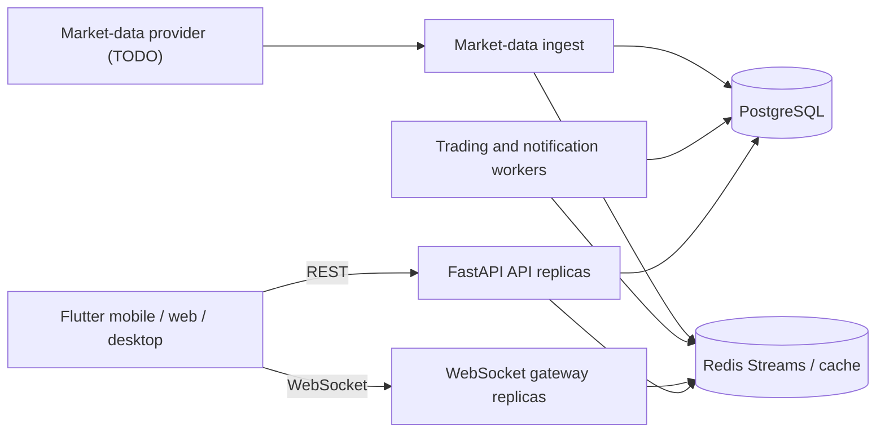

# NSE Options Paper Trading Platform Architecture

## 1. Architectural decisions

The first production version is a **modular monolith** for transactional APIs and
the paper-trading engine, plus separately scalable market-data, worker, and
WebSocket processes. Modules communicate through typed application ports and
domain events. This keeps order, execution, margin, portfolio, and ledger writes
in one PostgreSQL transaction while allowing high-volume tick distribution to
scale independently.

This product never routes an order to a broker or exchange. A market-data
provider is an adapter behind `MarketDataProvider`; provider credentials and
implementation are deliberately left as TODOs.

## 2. Runtime topology

Redis holds latest quotes, subscriptions, rate limits, ephemeral sessions, and
streams domain/tick events. PostgreSQL is authoritative for contracts, users,
orders, executions, positions, portfolios, trades, notifications, settings, and
audit records. Raw ticks should be time-partitioned and retained by policy; Redis
must never be the source of record for financial state.

## 3. Backend boundaries

Each module has `domain`, `application`, `infrastructure`, and `api` concerns.
Imports point inward: API and infrastructure depend on application/domain;
domain code does not import FastAPI, SQLAlchemy, Redis, or a vendor SDK.

- **Identity**: email, Google and guest sessions; profile and preferences.
- **Instruments**: contracts, expiries, option metadata and universal search.
- **Market data**: normalized ticks, quote cache, OHLC aggregation and streams.
- **Watchlists**: user lists, pinned contracts and dynamic ATM/ITM/OTM windows.
- **Trading**: order state machine, triggers, simulated fills and execution policy.
- **Portfolio**: positions, immutable executions/trades and virtual cash ledger.
- **Risk**: quantity/freeze/tick validation, margin and charge/PnL calculations.
- **Notifications**: durable inbox plus optional push/email adapters.
- **Audit**: append-only security and trading action log.

## 4. Critical invariants

1. Money and quantities use `Decimal`/PostgreSQL `NUMERIC`, never binary floats.
2. Every command has an idempotency key; duplicate order placement is harmless.
3. An order follows an explicit state machine and executions are immutable.
4. Portfolio, margin, position, execution, trade, and ledger updates commit in one
   database transaction with row/version locking.
5. Contract lot size, tick size, freeze quantity, multiplier, and active dates are
   validated against the version effective when the order is accepted.
6. Market timestamps and receive timestamps are stored in UTC; exchange calendars
   use `Asia/Kolkata`.
7. WebSocket delivery is resumable using monotonically increasing sequence IDs.
8. All user-scoped queries enforce ownership in both service and repository layers.

## 5. Order lifecycle

`CREATED -> VALIDATING -> OPEN -> PARTIALLY_FILLED -> FILLED`

Terminal alternatives are `REJECTED`, `CANCELLED`, and `EXPIRED`. Stop orders
remain `OPEN` with an untriggered condition; triggering is recorded before they
become market/limit executable. Modify and cancel use optimistic version checks.
Targets, stop losses, and trailing stops are linked child orders in an OCO group,
not mutable fields hidden inside a position.

## 6. Market-data flow

The provider adapter normalizes vendor payloads into `MarketTick`. The ingest
process validates sequencing and publishes to a partitioned Redis Stream keyed by
instrument token. Consumers update the latest-quote cache, aggregate OHLC,
evaluate pending orders, and fan out conflated client updates. Order evaluation
consumes every relevant tick; UI delivery may conflate ticks to protect clients.

## 7. Scale target

The 100,000-concurrent-user target requires horizontal API/WS replicas, sticky-free
connections, subscription indexes in Redis, per-user backpressure, binary or
compact JSON frames, and quote conflation. PostgreSQL uses PgBouncer, read replicas
for history, partitioned tick/audit tables, and narrowly scoped transactions.
Capacity must be proven by k6/Locust scenarios; it is not guaranteed by code alone.

## 8. API contracts

- REST base: `/api/v1`; OpenAPI: `/docs` and `/openapi.json`.
- Client command IDs use `Idempotency-Key`; mutations return resource versions.
- Market WebSocket: `/ws/v1/market?token=...`.
- User WebSocket: `/ws/v1/user?token=...` for orders, fills, PnL and notifications.
- Frames include `type`, `schema_version`, `sequence`, `timestamp`, and `data`.

## 9. Delivery sequence

1. Architecture, runtime foundation, migrations, contracts, observability.
2. Authentication, contract master/search, market adapter and quote streaming.
3. Order state machine, execution, ledger, positions, margin and PnL.
4. Watchlists/option chain, notifications, exports and settings.
5. Flutter responsive flows, offline cache and reconnection semantics.
6. Load, security, failure-recovery and deployment qualification.

